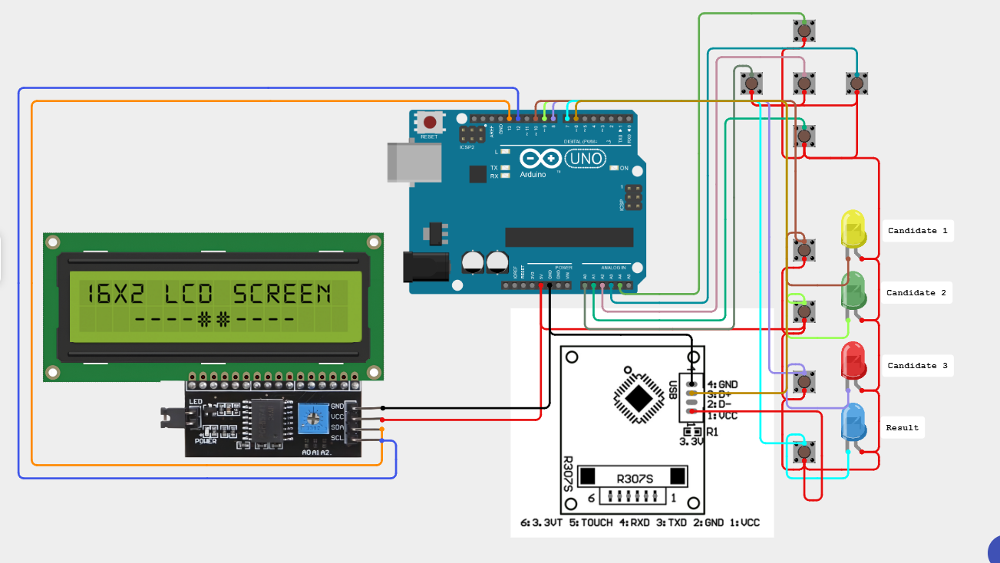

# 🗳️ Fingerprint-Based Electronic Voting Machine

This project is a **Fingerprint-Based Electronic Voting Machine** developed using an **Arduino Uno**, an **R307 fingerprint sensor module**, and a **16x2 LCD display**. It ensures secure, one-person-one-vote elections by verifying the voter's identity using their fingerprint before allowing them to cast their vote.

## 🔧 Hardware Components

- Arduino Uno
- R307 Fingerprint Sensor Module
- 16x2 LCD Display (I2C recommended)
- Push Buttons (for vote selection and confirmation)
- Breadboard & Jumper Wires
- Power Supply (USB or external 5V)
- (Optional) Buzzer & LEDs for feedback

## 📷 Circuit Diagram



> A complete circuit diagram is included in the `circuit-diagram/` folder or can be found in the repository root.

## ⚙️ Features

- Fingerprint registration and authentication
- Unique vote per registered fingerprint
- LCD user interface for status and instructions
- Vote counting for each candidate
- Secure and simple voting process

## 🚀 Getting Started

### 1. Clone the repository

```bash
git clone https://github.com/Ankan5960/Fingerprint-based-electronic-voting-machine.git
cd Fingerprint-based-electronic-voting-machine
```
### 2. Upload Code
Open **code/code.ino** in the **Arduino IDE**.

Select the correct board and port **(Tools > Board: "Arduino Uno", Tools > Port)**.

Upload the sketch.

### 3. Install Required Libraries
In the Arduino IDE, go to **Sketch > Include Library > Manage Libraries... and install**:

```
Adafruit Fingerprint Sensor Library
LiquidCrystal_I2C (if using I2C LCD)
```

### 4. Wiring Setup

### 🔌 Wiring Setup

| Component                 | Arduino Pin | Description                              |
| ------------------------- | ----------- | ---------------------------------------- |
| **Enroll Button**         | A0          | Used to enroll a new fingerprint         |
| **Delete Button**         | A1          | Used to delete fingerprint data          |
| **Up Button**             | A2          | Navigation or increase value             |
| **Down Button**           | A3          | Navigation or decrease value             |
| **Match Button**          | A4          | Used to match fingerprint                |
| **Result Button**         | A5          | Used to display voting results           |
| **Vote Indicator LED**    | D0          | Lights up when eligible to vote          |
| **Fingerprint Sensor TX** | D2          | Connected to Arduino RX (SoftwareSerial) |
| **Fingerprint Sensor RX** | D3          | Connected to Arduino TX (SoftwareSerial) |
| **LCD RS**                | D9          | Register Select pin                      |
| **LCD EN**                | D8          | Enable pin                               |
| **LCD D4**                | D7          | Data pin 4                               |
| **LCD D5**                | D6          | Data pin 5                               |
| **LCD D6**                | D5          | Data pin 6 *(shared, might be a typo)*   |
| **LCD D7**                | D4          | Data pin 7                               |
| **Vote Switch 1 (sw1)**   | D10         | Vote for Candidate 1                     |
| **Vote Switch 2 (sw2)**   | D11         | Vote for Candidate 2                     |
| **Vote Switch 3 (sw3)**   | D12         | Vote for Candidate 3                     |
| **Buzzer**                | D13         | Audio feedback                           |

Refer to the circuit diagram for the full connection layout.

## 🧠 How It Works
**Register Voters:** Use fingerprints to register voters into the R307 sensor.

**Authenticate:** When a user scans their fingerprint, it is matched against registered fingerprints.

**Vote:** Once authenticated, the voter selects their candidate using buttons.

**One Vote Policy:** A voter can vote only once. Duplicate attempts are blocked.

**Display Result:** Optionally, results can be shown on LCD or serial monitor.

## 🛡️ Security Features
**Biometric fingerprint authentication**

**One vote per fingerprint ID**

**No external input manipulation**

## 📁 File Structure

```bash
/Fingerprint-based-electronic-voting-machine
├── code/
│   └── code.png
├── circuit-diagram/
│   └── circuit.png
├── Project-Report.pdf
└── README.md
```

## 📚 References

[R307 Fingerprint Sensor Datasheet](https://components101.com/sensors/r307-optical-fingerprint-reader)

[Arduino UNO Official Documentation](https://www.arduino.cc/en/Main/ArduinoBoardUno)

[Adafruit Fingerprint Library](https://github.com/adafruit/Adafruit-Fingerprint-Sensor-Library)